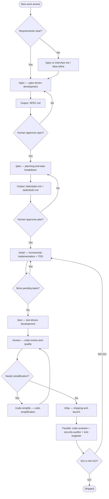
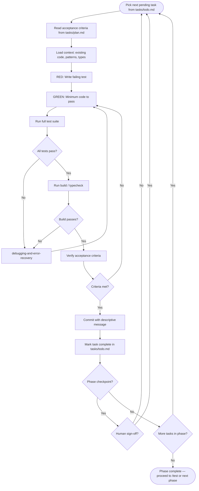

# Task Process Flowcharts

Visual guide for executing work using agent-skills slash commands and skills.

**Related artifacts:**

- [SPEC.md](../SPEC.md) — requirements and acceptance criteria
- [plan.md](./plan.md) — detailed task breakdown
- [todo.md](./todo.md) — checklist to track progress

For mid-task skill selection (UI, API, debugging, etc.), see the skill-discovery tree in [using-agent-skills](../skills/using-agent-skills/SKILL.md).

---

## 1. End-to-end lifecycle

User-driven pipeline from idea to shipped code. Human approval gates after spec and plan prevent wrong-direction work early.

**Notes:**

- `/build` repeats until all tasks in [todo.md](./todo.md) are checked off.
- Domain skills auto-activate during build (e.g. `frontend-ui-engineering`, `api-and-interface-design`).
- `/ship` runs a parallel fan-out of three personas; skip only for trivial changes (≤2 files, <50 lines, no auth/payments/data/config).

---

## 2. Per-task build loop

Inner loop for each task from [todo.md](./todo.md). Follow Red-Green-Refactor, verify acceptance criteria, commit, then move on.

**Phase checkpoints** (from [todo.md](./todo.md)):

| Phase                 | Checkpoint                                     |
| --------------------- | ---------------------------------------------- |
| 1 — Foundation        | Dev server runs; shared tests pass; hooks work |
| 2 — Core todos        | CRUD + filter + persist after refresh          |
| 3 — Enhanced features | All SPEC v1 features in browser                |
| 4 — E2E and CI        | Full pipeline green on `main`                  |
| 5 — Ship              | All SPEC success criteria met                  |

---

## Quick reference

| Phase    | Command          | Primary skill(s)                                       | Artifact                         |
| -------- | ---------------- | ------------------------------------------------------ | -------------------------------- |
| Define   | `/spec`          | spec-driven-development                                | `SPEC.md`                        |
| Plan     | `/plan`          | planning-and-task-breakdown                            | `tasks/plan.md`, `tasks/todo.md` |
| Build    | `/build`         | incremental-implementation, test-driven-development    | commits per task                 |
| Verify   | `/test`          | test-driven-development, browser-testing-with-devtools | passing tests                    |
| Review   | `/review`        | code-review-and-quality                                | review report                    |
| Simplify | `/code-simplify` | code-simplification                                    | cleaner diff                     |
| Ship     | `/ship`          | shipping-and-launch + 3 personas                       | GO/NO-GO + rollback plan         |
