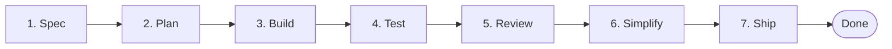
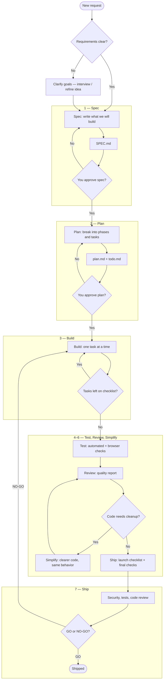
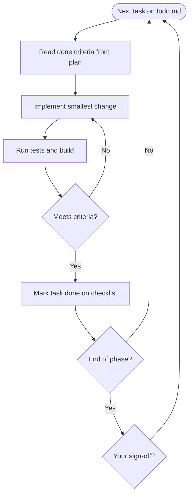

# Basic Workflow — Spec, Plan, Build, and Beyond

Simple guide to how work moves from **idea** to **shipped product**, using the same steps as the agent-skills lifecycle: **Spec → Plan → Build → Test → Review → Ship**.

Written for **non-technical** readers. Technical detail: [flowchart.md](./flowchart.md).

**Artifacts you may see:**
| Step | Main output |
|------|-------------|
| Spec | [SPEC.md](../SPEC.md) |
| Plan | [plan.md](./plan.md) + [todo.md](./todo.md) |
| Build | Working app + saved progress |
| Test / Review / Ship | Reports and go/no-go decision |

---

## The seven steps (overview)

| #   | Step         | One-line purpose              | You typically…               |
| --- | ------------ | ----------------------------- | ---------------------------- |
| 1   | **Spec**     | Agree _what_ to build         | Read and approve `SPEC.md`   |
| 2   | **Plan**     | Agree _how_ and in what order | Read summary; approve plan   |
| 3   | **Build**    | Implement task by task        | Demo at phase checkpoints    |
| 4   | **Test**     | Prove it still works          | Try key flows in the browser |
| 5   | **Review**   | Check quality and risks       | Read review summary          |
| 6   | **Simplify** | Clean up (only if needed)     | Optional — usually no action |
| 7   | **Ship**     | Launch decision               | Say **GO** or **NO-GO**      |

---

## Full workflow (with approvals)

**Two approval gates (before coding heavily):**

1. After **Spec** — wrong product avoided early.
2. After **Plan** — wrong order or missing steps avoided early.

---

## Each step explained

### 1. Spec — Define what we build

**Command (technical):** `/spec`  
**Plain meaning:** Turn the idea into a written agreement.

|               |                                                        |
| ------------- | ------------------------------------------------------ |
| **Input**     | Your goals, users, must-haves, and what is _not_ in v1 |
| **Output**    | `SPEC.md` — features, success criteria, out of scope   |
| **Your role** | Approve or request changes **before** build starts     |

**Example (Todo app):** List todos, due dates, tags, drag reorder; no login; data stays in browser.

---

### 2. Plan — Define how we build it

**Command (technical):** `/plan`  
**Plain meaning:** Split the spec into ordered phases and a checklist.

|               |                                                        |
| ------------- | ------------------------------------------------------ |
| **Input**     | Approved `SPEC.md`                                     |
| **Output**    | `tasks/plan.md` (detail) + `tasks/todo.md` (checklist) |
| **Your role** | Approve order and checkpoints                          |

**Example phases:** Setup → Foundation → Core todos → Extras → CI → Ship.

---

### 3. Build — Do the work in small pieces

**Command (technical):** `/build`  
**Plain meaning:** Complete one checklist item at a time; test as you go.

|               |                                                     |
| ------------- | --------------------------------------------------- |
| **Input**     | Approved plan + todo checklist                      |
| **Output**    | Working features; items checked off on `todo.md`    |
| **Your role** | Sign off at **phase checkpoints** (demo in browser) |

---

### 4. Test — Verify everything works

**Command (technical):** `/test`  
**Plain meaning:** Run automated tests and try the app like a user would.

|               |                                               |
| ------------- | --------------------------------------------- |
| **Input**     | All build tasks complete                      |
| **Output**    | Passing tests; confidence nothing major broke |
| **Your role** | Spot-check important flows in the browser     |

---

### 5. Review — Quality and safety check

**Command (technical):** `/review`  
**Plain meaning:** Structured review for bugs, clarity, and fit with the spec.

|               |                               |
| ------------- | ----------------------------- |
| **Input**     | Code + spec                   |
| **Output**    | Review report (issues ranked) |
| **Your role** | Decide if findings block ship |

---

### 6. Simplify — Clean up (optional)

**Command (technical):** `/code-simplify`  
**Plain meaning:** Make code easier to maintain **without** changing behavior.

|               |                                             |
| ------------- | ------------------------------------------- |
| **When**      | Only if review says complexity is a problem |
| **Your role** | Usually none — same app behavior            |

---

### 7. Ship — Ready to go live?

**Command (technical):** `/ship`  
**Plain meaning:** Final checklist: deploy, monitoring, rollback, and **GO / NO-GO**.

|               |                                                 |
| ------------- | ----------------------------------------------- |
| **Input**     | Test + review complete                          |
| **Output**    | Launch decision; live URL when GO               |
| **Your role** | **GO** = release; **NO-GO** = back to build/fix |

Three expert perspectives run in parallel (code, security, tests) before the final decision.

---

## Quick reference — Spec through Ship

| Step         | Say this                | Produces                 | Stop if…                  |
| ------------ | ----------------------- | ------------------------ | ------------------------- |
| **Spec**     | “Write the spec”        | `SPEC.md`                | Spec not approved         |
| **Plan**     | “Make the plan”         | `plan.md`, `todo.md`     | Plan not approved         |
| **Build**    | “Build the next task”   | App + checklist progress | Checkpoint not signed off |
| **Test**     | “Run tests”             | Green tests              | Tests fail                |
| **Review**   | “Review the change”     | Review report            | Critical issues open      |
| **Simplify** | “Simplify if needed”    | Cleaner code             | N/A (optional)            |
| **Ship**     | “Are we ready to ship?” | GO / NO-GO               | NO-GO → return to Build   |

---

## Where am I right now?

Ask in order:

1. **Is there an approved SPEC?** → If no, you are in **Spec**.
2. **Is there an approved plan and todo list?** → If no, you are in **Plan**.
3. **Are there unchecked items on the todo?** → If yes, you are in **Build**.
4. **Is build done but not fully tested/reviewed?** → **Test** or **Review**.
5. **Is everything green but not live?** → **Ship**.

**Checklist progress:** [todo.md](./todo.md)  
**Scope:** [SPEC.md](../SPEC.md)

---

## Technical names (same workflow)

For developers and AI agents using [flowchart.md](./flowchart.md):

| Step     | Slash command    | Skill                                                  |
| -------- | ---------------- | ------------------------------------------------------ |
| Spec     | `/spec`          | spec-driven-development                                |
| Plan     | `/plan`          | planning-and-task-breakdown                            |
| Build    | `/build`         | incremental-implementation, test-driven-development    |
| Test     | `/test`          | test-driven-development, browser-testing-with-devtools |
| Review   | `/review`        | code-review-and-quality                                |
| Simplify | `/code-simplify` | code-simplification                                    |
| Ship     | `/ship`          | shipping-and-launch                                    |

---

_Version 2 — basic workflow: Spec → Plan → Build → Test → Review → Simplify → Ship. Aligned with [flowchart.md](./flowchart.md)._
